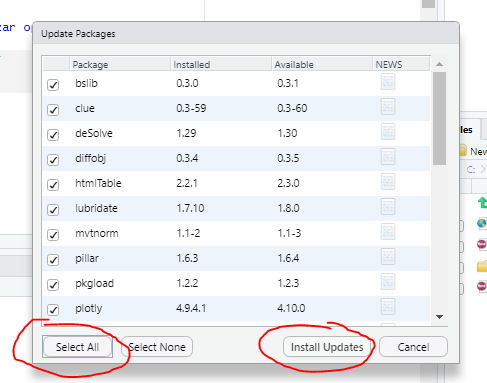
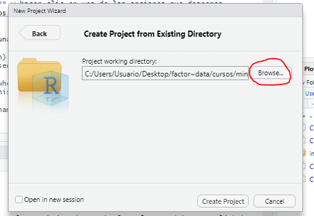

```{r setup, include=FALSE}
knitr::opts_chunk$set(echo=FALSE)
```

```{r message=FALSE, warning=FALSE, include=FALSE, paged.print=FALSE}
knitr::opts_chunk$set(echo=TRUE, message=FALSE, warning=FALSE, collapse=TRUE, highlight=TRUE, paged.print=FALSE, prompt=TRUE, strip.white=FALSE)
```

## Paquetes

### Instalación

En la clase anterior vimos que, gracias a la comunidad abierta de R, continuamente se van generando paquetes con nuevas funcionalidades para aumentar las posibilidades de todo lo que queremos hacer en R. Son algo así como la caja de herramientas donde están guardadas muchas funciones que podemos usar. Para instalar un paquete, hay que usar el comando:

```{r, eval=FALSE}
install.packages("nombre_del_paquete") #Con el nombre entre comillas
```

Este comando conecta la sesión de R directamente con  [CRAN](https://cran.r-project.org/) y descarga a la computadora - en la carpeta de instalación de R - los paquetes requeridos. Por ello, se requiere tener conexión a Internet para efectuar esta operación. 

### Actualización 
Los paquetes están sujetos a permanentes actualizaciones y mejoras. Por ello, también es necesario aprender cómo actualizarlos de manera continua y fácil. Para esto podemos hacer clic en **Tools -> Check for Package Updates**:



### Implementación

R funciona en la memoria temporal del programa (memoria RAM). Por eso, cada vez que abrimos el programa a través de RStudio este se abre en su versión básica  y los paquetes no aparecen precargados. Para poder usar una función correspondiente a un paquete que hayamos descargado se debe cargar al mismo en la sesión que estemos trabajando. Esto se hace con el comando `library`, en el cual no hay que indicar el nombre del paquete entre comillas. 

```{r, eval=FALSE}
library(nombre_del_paquete)
```

## Proyectos y rutas de trabajo

### Rutas de trabajo

Cuando abrimos un script, lo guardamos y almacenamos en una carpeta de nuestra computadora. Esto va a hacer que la ruta de trabajo (en inglés, el _working directory_) sea esa carpeta. Si queremos ver desde qué ruta estamos trabajando, hay que correr el comando: 

```{r}
getwd()
```

¿De qué nos sirve esto? Si yo quiero, por ejemplo, importar una base de datos que tengo descargada en la computadora, lo hago con la función `read.csv()`, a la cual hay que pasarle la ruta donde está guardado el archivo que deseo. Por ejemplo, si quisiera leer la base de Estadísticas criminales en la República Argentina que tengo guardada en la carpeta del curso, debería hacerlo así:

```{r}
df <- read.csv("~/Escritorio/Cursos/min_seguridad_curso/data/snic-pais-series.csv")
```

Ahora bien, ¿qué problemas tiene esto? 

1. Tengo que copiar una ruta larguísima cada vez que quiero importar un archivo nuevo.
2. Si le comparto el código a otra persona, la ruta se rompe. 
3. Si cambio de computad
ora, se rompe. 
4. Si muevo el archivo, se rompe. 

Por eso, existe la solución de **crear proyectos en RStudio**.

### Proyectos

Hay 3 formas de crear un proyecto en R:

- en un directorio nuevo
- asociándolo a un directorio existente
- clonando una versión de control (asociado a Git, algo que no veremos en este curso)

Para hacerlo, hay que ir a **File -> New Project...** y hacer clic en una de las opciones que deseemos. 


Buscamos la ruta de la carpeta donde queremos que se cree el proyecto haciendo clic en "Browse":



Esto hace lo siguiente:

- Crea un archivo de proyecto (con extensión .RProj) en el directorio que elegimos. Este archivo sirve para abrir el proyecto en R Studio haciendo directamente clic en él.
- Crea un directorio escondido (que se llama .Rroj.user) donde se almacenan los archivos temporales específicos del proyecto (por ejemplo, puedo cerrar la sesión de R y mantener ahí los objetos del Enviroment de manera que vuelvan a aparecer cuando abra de nuevo el programa). 
- Carga el proyecto en RStudio y muestra su nombre en la barra de opciones de R Studio.

Cada vez que abramos un proyecto de R, van a ver que en el panel de salida de la pantalla, en la pestaña que dice *Files* se encuentra un directorio con todos los elementos que hay en esa carpeta. 


Ahora podemos abrir los archivos de manera más simple y compartir los proyectos de R de manera que puedan reproducirse en otras computadoras. Por ejemplo, para leer el archivo que queríamos antes, puedo escribir simplemente: 
```{r}
df <- read.csv("./data/Base_PUFEAF.csv")
head(df)
```
Si por algún motivo queremos navegar por una carpeta superior a la que nos encontramos (siguiendo nuestro ejemplo, si quisiésemos buscar algo en la carpeta 'cursos'), podemos ubicarnos con `../`. Este símbolo lo que hace es ir hacia atrás en las carpetas.

Por lo general, una buena práctica a la hora de crear una carpeta de proyecto es crear en la misma tres sub-carpetas:

* data 
  + raw
  + procesada
* scripts

## Lectura y escritura de datos

En el ejemplo anterior vimos la función `read.csv()`. Esta es solo una de las tantas formas que tenemos para importar archivos en R. Existe una función para cada extensión de archivo: 

### Importación con R base

-  `read.csv()` -> para .csv. Tiene los argumentos: 
	+ `file`: string con el nombre y la ruta del archivo a importar
	+ `header`: logical indicado si el archivo tiene cabeceras
	+ `colClasses`: character vector que indica la clase de cada columna ("character","integer",etc.)
	+ `nrows`: cantidad de filas en el dataset
	+ `skip`: cantidad de filas que hay que saltear contando desde el principio en el dataset
	+ `stringAsFactors`: logical que indica si al importar el archivo deben codificarse los strings como factors
	+ `fileEncoding`: string con el encoding del archivo. Esto es **muy importante**, la mayoría de los problemas en la lectura de datos se dan porque el archivo se está leyendo en un formato que no corresponde. 
- `read.table()` -> para .txt. Tiene los mismos argumentos que `read.csv()`, pero además se agreaga:
  + `sep` : string que indica cómo se separan las columnas
- `read.rds()` -> para .RDS. Este es un formato de archivo especial, ya que se genera únicamente con R cuando exportamos un objeto que tenemos en nuestra sesión. Tiene la ventaja de almacenar los niveles de los `factor()` cuando lo exportamos. 

Si el archivo no es muy grande puede usarse directamente:
```{r, highlight=TRUE, prompt=TRUE, strip.white=FALSE, collapse=TRUE, tidy=TRUE,eval=FALSE}
data<-read.table("prueba.txt")
```

R va a realizar algunas tareas automáticamente:
- saltear las líneas que empiezan con #
- calcular cuántas filas hay y cuánta memoria necesita reservar
- identificar la clase de cada columna

Ahora, si nos encontramos con un dataset grande, conviene setear el argumento `colClasses`: suele ser mucho más rápido dado que R no tiene que realizar la tarea de detectar los tipos de cada columna. 
	+ Setar `nrows` esto ayuda a usar menos memoria... no a que sea necesariamente más rápido.
```{r, highlight=TRUE, prompt=TRUE, strip.white=FALSE, collapse=TRUE, tidy=TRUE,eval=FALSE}
init<-read.table("prueba.txt",nrows=100)
classes<-sapply(init,class)
todos<-read.table("prueba.txt"
		  ,colClasses = classes)
```	

* Además de todo esto es importante hacer una estimación gruesa de la memoria que va a requerir cargar el dataset.
* Si la memoria requerida es más de la dispnible en el el sistema... 
* Cálculo grueso: supongamos un dataframe con 2.000.000 de filas y 200 columnas todos datos numéricos
	+ 2.000.000 x 200 x 8 bytes/numerics
	+ 2.400.000.000 bytes
	+ 2.400.000.000 bytes / 2^20 bytes/MB
	+ 2.288,8 MB
	+ 2.24 GB

### Importación con paquetes adicionales

A este listado le faltan varios formatos de archivo bastante comunes en en el análisis de datos: el formato STATA, SPSS y Excel. Para ello existen `heaven()` y `readxl()`, dos paquetes diseñados específicamente para este tipo de archivos. 

- `read_spss()` : para archivos de SPSS
  + `file`: nombre y la ruta del archivo a importar
- `read_stata()` : para archivos de STATA
  + `file` : nombre y la ruta del archivo a importar
  + `encoding` : string con el encoding del archivo
  + `col_select` : selecciono columnas a importar
  + `skip` : cuantas filas saltearse en la lectura
  + `n_max` : máximo número de filas a importar
- `read_xlsx()` : para archivos de Excel
  +`file`
  
Además, existe un paquete del mundo `tidyverse` (que veremos en profundidad la próxima clase) llamado `readr` que es el recomendado para leer archivos de texto plano (csv, txt). Las diferencias entre cada una de sus funciones está en los parámetros que poseen para mejorar la importación.

- `read_csv`, `read_tsv` y `read_delim`:
  + `file`
  + `col_names` : indica si la primera fila es los nombres de las columnas
  + `col_types` : puedo indicar los tipos de columna
  + `delim` : este parámetro está solo en read_delim, indica qué caracter va como delimitador de columnas. 
  
Una vez tenemos la base de datos cargada en el entorno, podemos ver sus características de manera rápida en la esquina superior derecha de la pantalla.


Haciendo clic en ese archivo, también podemos ver el dataframe. 


### Exportación de archivos 

Cada una de las funciones que vimos arriba tienen su complemento en una función para exportar archivos. Algunas de ellas son:

- `write_csv()`
- `write.xlsx()`
- `saveRDS()`
- `write_sav()`
- `write_dta()`

En general estas funciones tienen un primer parametro para especificar el objeto a exportar, y un segundo para especificar la ruta y el nombre de archivo a crear. 

```{r}
library(readr)

nombres <- c("Ana", "Pedro", "Luis")
edades <- c(34, 54, 29)
df_juguete <- data.frame(nombres, edades)

write_csv(df_juguete, './data/df_ejemplo.csv')
```

A modo de síntesis, el flujo de trabajo para un proyecto en R es el siguiente:

1. Crear una carpeta con las sub carpetas necesarias para mantener todo organizado (data, code)
2. Crear un .RProj asociado a esa carpeta
3. Almacenar la base que se va a usar en la carpeta de data
4. Empezar a escribir el código! 