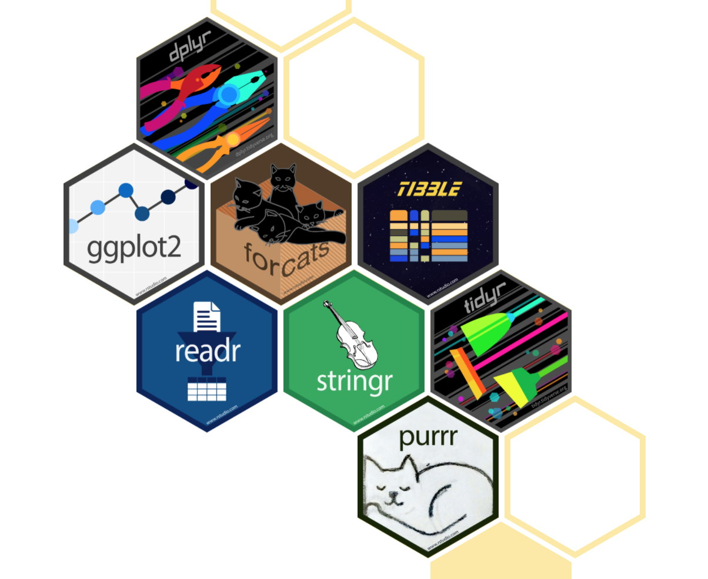

```{r setup, include=FALSE}
knitr::opts_chunk$set(echo=FALSE)
```

```{r message=FALSE, warning=FALSE, include=FALSE, paged.print=FALSE}
knitr::opts_chunk$set(echo=TRUE, message=FALSE, warning=FALSE, tidy=TRUE)
```

## El mundo tidyverse

- La clase pasada cerramos la parte práctica instalando el paquete **Tidyverse**. Sin embargo, al hacerlo no estaban instalando solo un paquete, sino una colección de paquetes de R que están diseñados para el análisis de datos. 
- La lógica de tener estos paquetes juntos es que todos ellos comparten la misma filosofía, gramática, y estructuras de datos. 



- Los principales paquetes que están en este mundo son
  + `magrittr`: que introduce la **pipe** (%>%)
  + `dplyr`: orientado a la maniplulación de bases de datos
  + `tidyr`: para la limpieza de datos
  + `readr`: para la lectura de bases de datos
  + `purr`: provee herramientas para trabajar con funciones sobre vectores
  + `stringr`: orientado a facilitar el trabajo con datos de texto
  + `forcats`: orientado a facilitar el trabajo con factores
        
### ¿Por qué tidyverse? 

- Está diseñado para ser leído y usado de manera simple por seres humanos. La gramática es intuitiva y la mayoría de sus funcionalidades son fáciles de usar. 
- Sus funciones no están pensadas para una tarea específica, sino para todo un flujo de trabajo: desde la importación de datos hasta la comunicación de resultados. 
- Su comunidad está basada en los principios de código abierto y colaborativo. Los mismos diseñadores de los paquetes tienen [muchísimas fuentes](https://www.tidyverse.org/learn/) para aprender a usarlos, y disponen del código abierto de cada paquete en GitHub. 

Para empezar a trabajar con el paquete, tenemos que introducirlo en la sesión con la función `library()`: 

```{r, echo=TRUE, warning=TRUE}
library(tidyverse)
```

## Pipes: la gramática básica de tidyverse

Más arriba mencionamos que el paquete `magrittr` introduce la pipe y la señalamos como este símbolo `%>%`. La pipe es una **forma de escribir** del mundo tidyverse, que indica que vamos a realizar de terminada operación sobre el objeto que está a la izquierda. Sirve para indicar una secuencia de acciones. 

Por ejemplo, tomemos la base de datos del SNIC a nivel provincial. Supongamos que queremos obtener la media de cantidad de hechos de todos los tipos de delito en todas las provincias.### ESTO NOCAMBIAR!!! Sin el pipe, lo haríamos así: 
```{r}
robos_autos <- read.table("./data/dnrpa-robos-recuperos-autos-202109.csv", sep = ",", 
                        header = TRUE, encoding = "UTF-8", stringsAsFactors = F)

table(robos_autos$titular_genero)
```

Ahora, con una pipe...
```{r}
robos_autos$titular_genero %>%
        table()
```

Las funciones pueden concatenarse, y esta es la principal gracia del uso de las pipes. 

```{r}
robos_autos$titular_genero%>%
        table()%>%
        prop.table()%>%
        round(., 2)
```


## dplyr

Vimos que este paquete de tidyverse está orientado al manejo de bases de datos. Tiene 5 funciones básicas que resuelven el 90% de nuestros problemas a la hora de limpiar y procesas bases: 

1. `select()`: que selecciona y descarta variables
2. `filter()`: selecciona y descarta según filas
3. `mutate()`: crea o edita variables
4. `rename()`: renombra variables
5. `summarise()`: colapsa los valores a un solo resumen

Todas pueden ser usadas en conjunto con `group_by()` que cambia el objeto de cada función: en lugar de operar sobre todo el dataset, lo hace al interior de cada grupo definido.

### select()

- Esta función únicamente requiere poner el nombre de las columnas que elegimos.
  +Para seleccionar un intervalo de columnas, uso el `:`

```{r}
select_prueba_1 <- robos_autos %>% select(tramite_fecha, fecha_inscripcion_inicial, registro_seccional_codigo:registro_seccional_provincia)

head(select_prueba_1)
```

- Podemos hacer una selección por **posición de la columna**: 

```{r}
select_prueba_2 <- robos_autos %>% select(3:6)

head(select_prueba_2)
```

- Se puede hacer una anti-selección (o sea, elegir todas las columnas menos algunas especificadas)
```{r}
select_prueba_3 <- robos_autos %>% select(-c(tramite_tipo:automotor_uso_descripcion))

head(select_prueba_3)
```

- También, se pueden seleccionar columnas según criterios con funciones auxiliares:
  + `starts_with` : selecciona columnas que empiecen con el string que pasemos.
  + `ends_with` : selecciona columnas que terminen con el string que le pasemos. 
  + `contains` : selecciona columnas que contengan la palabra que indicamos. 
```{r}
select_prueba_4 <- robos_autos %>% select(starts_with("titular"))

head(select_prueba_4)

select_prueba_5 <- robos_autos %>% select(contains("domicilio"))

head(select_prueba_5)
```
### rename()

- Esta función solo requiere indicar `NOMBRE_NUEVO = NOMBRE_VIEJO`

```{r}
rename_prueba_1 <-robos_autos %>% rename(fecha = fecha_inscripcion_inicial) 
colnames(robos_autos)
colnames(rename_prueba_1)
```
- También se puede usar la versión `rename_with()` para cambiarle el nombre a una selección de columnas: 

```{r}
rename_prueba_2 <- robos_autos %>% rename_with(toupper, starts_with("registro"))
colnames(robos_autos)
colnames(rename_prueba_2)
```

### filter()

- Esta función tiene el siguiente esquema: `filter(CONDICIÓN)`
- La clase 1 vimos los distintos operadores (lógicos, arimétricos, relacionales) que podemos usar para escribir estos formatos condicionales. 

Supongamos que queremos quedarnos con los registros de autos cuyos titulares tienen 50% o menos de su titularidad:
```{r}
base_filtrada_1 <- robos_autos %>% filter(titular_porcentaje_titularidad <= 50)

table(base_filtrada_1$titular_porcentaje_titularidad)
```

Por ejemplo, supongamos que queremos obtener los registros de robos realizados en Córdoba:

```{r}
base_filtrada_2 <- robos_autos %>% filter(registro_seccional_provincia == "Córdoba")

table(base_filtrada_2$registro_seccional_provincia)
```

Los condicionales también pueden combinarse. Podríamos traer todos los registros de Córdoba y de Santa Fe:

```{r}
base_filtrada_3 <- robos_autos %>% filter(registro_seccional_provincia == "Córdoba" | registro_seccional_provincia == "Santa Fe")

table(base_filtrada_3$registro_seccional_provincia)
```

Ahora bien, ¿cómo hacemos si queremos los registros de Córdoba y Santa Fe pero sólo de automotores nacionales? 

```{r}
base_filtrada_4 <- robos_autos  %>% filter(registro_seccional_provincia %in% c("Córdoba", "Santa Fe") & automotor_origen == "Nacional")

table(base_filtrada_4$automotor_origen, base_filtrada_4$registro_seccional_provincia)
```

`%in%` es una forma de indicar que vamos a buscar los valores del vector en la columna que indicamos. Sería lo mismo que hacer: 

```{r}
base_filtrada_4 <- robos_autos  %>% filter((registro_seccional_provincia == "Córdoba" & automotor_origen == "Nacional") | (registro_seccional_provincia == "Santa Fe" & automotor_origen == "Nacional"))
```

Pero de manera simplificada. 

El filtrado también puede aplicarse sobre columnas para quedarnos sólo con las filas que tienen valores -es decir, borrar los NA. 

Vamos a borrar los casos que tienen NA en el año de nacimiento del titular. Probemos que pasa si usamos el operador `==`
```{r}
base_filtrada_4 <- robos_autos  %>% filter(titular_anio_nacimiento != NA) %>% select(titular_anio_nacimiento)

nrow(base_filtrada_4)
```

¡Nos borró todas las variables! Pero esto no está bien, ya que vimos que esta columna tenía varios valores. ¿Qué sucedió? 

Resulta que los NA son bastante tramposos en R. Casi cualquier operación con uno de ellos va a devolver otro NA, y es por esto que no debemos trabajar con operadores a la hora de filtrarlos, sino que debemos usar la función `is.na()`
```{r}
base_filtrada_5 <- robos_autos  %>% filter(!is.na(titular_anio_nacimiento)) %>% select(titular_anio_nacimiento)

nrow(base_filtrada_5)
```

### mutate()

- Esta función nos permite crear y modificar columnas.
- Suele ser útil crear columnas como funciones de columnas ya existentes
- Su sintaxis es `mutate(nombre_de_la_columna = valores_de_la_columna)`  

Por ejemplo, podemos crear una columna simple con el nombre de la base:
```{r}
mutate_1 <- robos_autos %>% mutate(columna_ejemplo = "Registro de robos y recuperos de autos DNRPA") 
head(mutate_1)
```

Pero también podemos hacer algo más util. Por ejemplo, si echamos un vistazo a la información del domicilio y el país de nacimiento del titular, vemos que estos valores están todos en mayúscula:

```{r}
filtrado_titular <- robos_autos %>% select(titular_domicilio_provincia, titular_domicilio_localidad, titular_pais_nacimiento)

str(filtrado_titular)
```

Vamos a guardar los valores como nombres propios con la función `str_to_title()` del paquete `stringr` **NOTA: HACER QUE EN UN EJERCICIO PREVIO A LA CLASE DESCARGUEN EL PAQUETE**

```{r}
mutate_2 <- robos_autos %>% mutate(
        titular_domicilio_provincia = str_to_title(titular_domicilio_provincia),
        titular_domicilio_localidad = str_to_title(titular_domicilio_localidad),
        titular_pais_nacimiento = str_to_title(titular_pais_nacimiento)
)%>%select(titular_domicilio_provincia, titular_domicilio_localidad, titular_pais_nacimiento)

head(mutate_2)
```

- Es una función muy útil a la hora de recodificar variables, sobre todo cuando la usamos con la función `case_when()`. 

Supongamos que queremos hacer una variable codificada del género del titular. Queremos que 1 sea "Masculino", 2 "Femenino" y 999 en los casos que no se contestó o no corresponde.

```{r}
mutate_3 <- robos_autos %>% mutate(
        genero_codif = case_when(
                titular_genero == "Masculino" ~ 1,
                titular_genero == "Femenino" ~ 2, 
                titular_genero %in% c("No identificado", "No aplica") ~ 999
        )
)

table(mutate_3$titular_genero, mutate_3$genero_codif)
```

