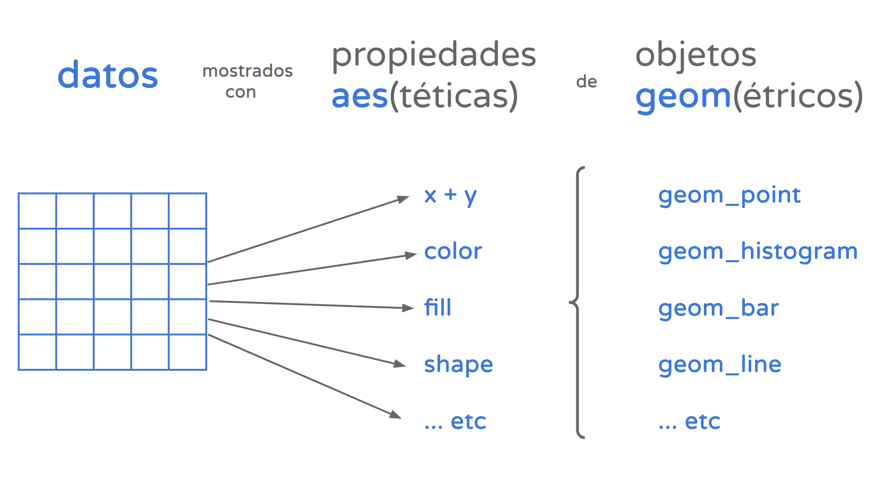

```{r setup, include=FALSE}
knitr::opts_chunk$set(echo=FALSE)
```

```{r message=FALSE, warning=FALSE, include=FALSE, paged.print=FALSE}
knitr::opts_chunk$set(echo=TRUE, message=FALSE, warning=FALSE, collapse=TRUE, highlight=TRUE, paged.print=FALSE, prompt=TRUE, strip.white=FALSE)
```

## Introducción

Una de las grandes ventajas de `tidyverse` es el paquete para realizar gráficos, `ggplot`. 

- Incluye funciones para realizar una gran variedad de visualizaciones. 
- Su concepto central es la asignación (*mapping* en inglés) de atributos estéticos a los valores que toma una variable. Dicho de otra forma, permite mostrar de modo perceptible a la vista la diferencia entre valores: con distintos colores, distintos tamaños, distintas posiciones en un gráfico, etc.

```{r, echo=TRUE, warning=TRUE}
library(tidyverse)
```

Vamos a trabajar con la base de homicidios dolosos: 

```{r}
df <- readxl::read_xlsx("data/Integrado_HD_base_usuaria_2017-2020.xlsx")

df <- df %>% mutate(region = case_when(
        provincia %in% c("CORRIENTES", "CHACO", "MISIONES", "FORMOSA") ~ "NEA",
        provincia %in% c("TUCUMÁN", "JUJUY","SALTA", "CATAMARCA", "SANTIAGO DEL ESTERO", "LA RIOJA") ~ "NOA",
        provincia %in% c("SAN LUIS", "MENDOZA", "SAN JUAN") ~ "Cuyo",
        provincia %in% c("SANTA FE", "CORDOBA", "BUENOS AIRES", "CIUDAD DE BUENOS AIRES", "ENTRE RIOS") ~ "Pampeana",
        provincia %in% c("LA PAMPA", "NEUQUEN", "RIO NEGRO", "CHUBUT", "SANTA CRUZ", "TIERRA DEL FUEGO") ~ "Patagonica"
))
```

## Uso de ggplot

La unidad básica de este paquete es la función `ggplot()`. Veamos qué sucede si la llamamos:

```{r}
ggplot()
```

No se ve nada: nos aparece como un lienzo en blanco. Esto es porque la creación de visualizaciones `ggplot` sigue un marco teórico: ["la gramática de los gráficos"](https://www.slideshare.net/0xdata/leland-wilkinson-h2oai-the-grammar-of-graphics-and-the-future-of-big-data-visualization-h2o-world-2019-nyc). A grandes rasgos, podemos decir que esta gramática requiere que definamos como mínimo dos cosas: 

- una **geometría**: este es el recurso visual con el que vamos a mostrar la información. Pueden ser líneas (`geom_line()`), puntos (`geom_point()`), barras (`geom_bar()`), u otros.

- una **asignación estética** (`aes`): tenemos que indicar las variables que queremos mostrar, y que atributo estético va a representar sus valores. Podemos representar visualmente las variables a través de distintos canales: puede ser a través del color, el tamaño, la transparencia, etc. 



Vamos a intentarlo. Primero generemos la tabla 1 que hace un conteo de hechos por año a partir de los valores únicos de la columna `Id_hecho`. Luego, asignémosle al atributo `x` la variable `anio`, `n` al atributo `y`  y usemos `geom_bar` para mostrar los datos.

```{r}
tb1 <- df %>% group_by(anio)%>%
        summarise(n=n_distinct(Id_hecho))

ggplot(tb1, aes(x=anio, y = n))+
        geom_bar(stat = 'identity')
```

`geom_bar` es *una forma* de hacer un gráfico de barras. Por default la función hace el conteo de frecuencias para la variable deseada. Como en este caso ya hicimos el conteo nosotros, le pasamos el atributo `stat = 'identity'`. `ggplot` [tiene un amplio repertorio de geometrías](https://www.maths.usyd.edu.au/u/UG/SM/STAT3022/r/current/Misc/data-visualization-2.1.pdf).

## Combinación con gramática tidy

Al estar incluida en el mundo `tidyverse`, podemos combinar ggplot con otros objetos a través de `%>%`. Esto es útil sobre todo en combinación con la función `group_by()` para realizar conteos de frecuencias, sumas de columnas, y otras operaciones. Probemos agrupando la cantidad de víctimas por año y haciendo un gráfico que pone `anio` en el eje `x`, el `total` en el eje `y` y usa la geometría `geom_line()`.

```{r}
df %>% group_by(anio, Id_hecho)%>%
        summarise(total=sum(cant_vic))%>%
        mutate(total_vict = sum(total)) %>%
        ggplot(aes(x=anio, y=total_vict))+
        geom_line()
```

Combinando con tidyverse también podemos hacer gráficos de frecuencias relativas. Vamos a usar `group_by` para obtener los porcentajes y le vamos a pasar la variable `anio` al eje x, `perc` al eje y y la geometría `geom_col()`, también nos sirve para crear un gráfico de barras al cual se le puede pasar un valor al argumento y. 

```{r}
df %>% group_by(anio)%>%
        summarise(n=n())%>%
        mutate(total=sum(n),
               perc = (n/total)*100)%>%
        ggplot(aes(x=anio, y=perc))+
        geom_col()
```

## Agregándole color

Podemos mostrar más variables agregando colores a los gráficos. Vamos a hacer un conteo de las clases de arma según año, y graficarlo asignándole la variable `anio` al atributo `x`, `n` al atributo `y`, `clase_arma` al atributo `color` y le vamos a pasar la geometría `geom_line()`.

```{r}
df %>% group_by(anio, clase_arma)%>%
        summarise(n=n())%>%
        ggplot(aes(x=anio, y=n, color=clase_arma))+
        geom_line()

```

Ahora bien, también podemos usar los colores para representar proporciones y cantidades por grupo. Para eso usamos el atributo `fill` en la mayoría de nuestros gráficos. Por ejemplo, vamos a hacer el gráfico de frecuencia de casos anuales pero con la proporción de provincias. Repetimos el primer gráfico que hicimos pero con algunos cambios. Vamos a usar geom_col, asignándole al atributo `fill` la variable provincia, y el valor `fill` al atributo `position` dentro de la geometría. 

```{r}
df %>% group_by(anio, region)%>%
        summarise(n=n_distinct(Id_hecho)) %>%
        ggplot(aes(x=anio, y = n, fill = region))+
        geom_col(position = "fill")
```

`position = "fill"` indica que queremos que las categorías de la variable llenen la barra en una proporción de 0 a 1. Los otros dos valores que puede adoptar este argumento son `"stack"` o `"dodge"`. 

Para escapar un poco de las barras, también podría mostrar los resultados en un gráfico de densidad. Lo que muestran es la distribución de probabilidad de la variable, es decir que tan probable es encontrar un valor determinado si tomaramos al azar una de las observaciones. Para esto, tenemos que pasarle al atributo `x` la variable de interés y agregar la geometría `geom_density()`. Probémoslo.

```{r}
df %>% 
        ggplot(aes(x=anio))+
        geom_density()
```
Las ventajas de un gráfico de densidad se ponen de relieve a la hora de comparar los resultados según categorías interenas de la data. Por ejemplo, is queremos mostrar las distintas distribuciones de cantidad de inculpados por provincia, usamos el atributo estético "fill" al igual que con los gráficos de barras. Sería así:

```{r}
df %>% 
        ggplot(aes(x=anio, fill = region))+
        geom_density()
```
Para revelar cualquier “sorpresa” que pudiera haber quedado oculta en las distribuciones tapadas por otras, ajustamos el atributo de `alpha`, que por cierto puede usarse con cualquier geometría de ggplot para controlar su grado de transparencia. Intentemos asignando una transparencia del 50% con `alpha = 0.5`:

```{r}
df %>% 
        ggplot(aes(x=anio, fill = region))+
        geom_density(alpha=0.5)
```

`ggplot` automáticamente asigna una paleta de colores predeterminada. Sin embargo, podemos instalar paquetes que introducen una gama de paletas nuevas, generalmente mejores que las que tiene R. Por ejemplo `viridis` trae paletas que, además de ser lindas, están diseñadas para poder imprimirse en escala de grises y ser interpretadas por personas con daltonismo. Probemos usar una paleta de este paquete en nuestro gráfico de arriba. Primero vamos a importar la librería `viridis`, y vamos a agregarle al código anterior la capa `scale_fill_viridis_d`, con el valor `magma` en el atributo `option`. 

```{r}
library(viridis)

df %>% 
        ggplot(aes(x=anio, fill = region))+
        geom_density(alpha=0.5)+
        scale_fill_viridis_d()
```

Otra cosa que podemos hacer es asignar los colores manualmente. R viene con [varios colores que podemos llamar por su nombre en inglés](http://www.stat.columbia.edu/~tzheng/files/Rcolor.pdf), pero si queremos colores que no están disponibles en esta paleta podemos usar hex codes. Vamos a probarlo haciendo un gráfico de barras de la variable `sexo_inculpado`, filtrando únicamente según sexo femenino o masculino. 

```{r}
colores <- c("Femenino" = 'forestgreen', "Masculino" = 'darkorchid2')

df %>% filter(sexo_inculpado %in% c("Femenino", "Masculino"))%>%
        ggplot(aes(x=anio, fill = sexo_inculpado))+
        geom_bar(position = "dodge")+
        scale_fill_manual(values = colores)
```

### Tamaños y dimensiones 

Hasta ahora estuvimos trabajando con el atributo estético de los colores y gráficos de barras. Pero estos gráficos no son tan útiles cuando queremos ver la relación que hay entre dos variables numéricas o más. En este caso son útiles los los gráficos de dispersión, o _scatterplots_. Consisten en puntos proyectados en un eje de coordenadas, donde cada punto representa una observación. 

Pongamos un caso concreto: queremos ver la relación entre los casos según año, provincia y cantidad de víctimas. Primero vamos a hacer una operación con group by para obtener la data que nos interesa. 

```{r}
vict_prov_anio <- df %>% group_by(anio, region) %>%
        summarise(n = n_distinct(Id_hecho), #Cuento la cantidad de Id_hechos 
                  tot_vic = sum(cant_vic))%>% #Cuento la cantidad de víctimas
        ungroup()%>%
        mutate(tasa_vic = tot_vic/n) 

head(vict_prov_anio)
```

Vamos a graficar las tres variables que nos interesan en un **scatterplot** asignando `anio` al eje x, `n` al eje y, `provincia` al atributo `color` y `tasa_vic` al atributo `size`. 

```{r}
ggplot(vict_prov_anio, aes(x = anio, y = n, color = region, size = tasa_vic))+
        geom_point()+
        scale_color_viridis_d(option = "inferno")
```

Podemos ver que este gráfico tiene por lo menos un problema que dificulta su lectura. Uno de los más notorios es que existen grandes disparidades en el n de casos: Buenos Aires tiene más de 1500 casos en todos los años, mientras que el resto de las provincias tienen por debajo de 1000. 

En estas situaciones, es útil usar una escala logarítmica para presentar los datos. Esto va a hacer que los valores de un eje no crezcan de manera proporcional, sino en potencias de diez. ¿Para que sirve esto? Para visualizar datos en los que existen grandes disparidades en una variable, porque permite que los valores pequeños tengan espacio para diferenciarse, y a la vez que los muy grandes no aparezcan tan alejados, logrando un gráfico más compacto y en general más legible. 

En todo caso, `ggplot2` incluye varias funciones para transformar las escala de las $x$ o de las $y$, entre ellas las que pasan las variables a escala logarítmica de base 10: `scale_x_log10()` y `scale_x_log10()`. ¿Cual usaríamos aquí?


```{r}
ggplot(vict_prov_anio, aes(x = anio, y = n, color = region, size = tasa_vic))+
        geom_point()+
        scale_y_log10()+
        scale_color_viridis_d(option = "inferno")
```


### Cambiando el "tema"

Hemos podido ajustar los atributos gráficos que dependen estrechamente de los datos, como las escalas, los colores y los tamaños. ¿Pero que hay de otros componentes visuales que podríamos cambiar, como la tipografía y su tamaño o el color de fondo? 

Esos atributos corresponden al "tema" (_theme_ en inglés) que apliquemos. Los temas son un set de parámetros que definen el aspecto de todos los componentes no relacionados con los datos, y pueden cambiar cómo se ven nuestros gráficos. El paquete `ggplot2` incluye varias funciones que aplican [temas predefinidos](https://ggplot2.tidyverse.org/reference/ggtheme.html), como "theme_dark", "theme_void", "theme_minimal", etc. Por eso para usar los temas alcanza con sumar una línea que llame a la función correspondiente. Por ejemplo, para usar "theme_dark":

```{r}
df %>% filter(sexo_inculpado %in% c("Femenino", "Masculino"))%>%
        ggplot(aes(x=anio, fill = sexo_inculpado))+
                geom_bar(position = "dodge")+
        scale_fill_manual(values = colores)+
        theme_dark()
```

Incluso podríamos definir a mano cada componente visual de los gráficos, creando así nuestro propio tema. No vamos a entrar en detalles ahora, pero para quien tenga interés el camino comienza por el uso de la [función `theme`](https://ggplot2-book.org/polishing.html#modifying-theme-components). También existen paquetes de R que agregan a nuestro arsenal nuevos temas listos para usar, como [`ggthemes`](https://ggplot2.tidyverse.org/reference/theme.html) y [`hrbrthemes`](https://cinc.rud.is/web/packages/hrbrthemes/). 

Para cerrar el tema de los temas (¡ja!) va una recomendación. El tema minimalista "theme_minimal" viene con `ggplot2` por lo que ya lo tenemos disponible, y con sólo agregar la línea que lo aplica obtenemos un gráfico de aspecto más "limpio" que el del tema por default:

```{r}
df %>% filter(sexo_inculpado %in% c("Femenino", "Masculino"))%>%
        ggplot(aes(x=anio, fill = sexo_inculpado))+
                geom_bar(position = "dodge")+
        scale_fill_manual(values = colores)+
        theme_minimal()
```

## Otras formas de ver comparaciones 

Hasta ahora vimos que podemos ver comparaciones en un gráfico mediante colores o representación en ejes. Sin embargo, también podemos mostrar las categorías en distintos paneles. Esto lo hacemos con `facet_wrap`.  Por ejemplo, veamos cómo se distribuyen los lugares de homicidio por región a lo largo de los años. 

```{r}
#Primero hacemos una tabla con la cantidad de homicidios por lugar según región y año
region_lugar <- df %>% group_by(anio, region, tipo_lugar) %>% 
                        summarise(n=n_distinct(Id_hecho))
```
El total lo veríamos de la siguiente manera:

```{r}
ggplot(region_lugar, aes(x=region, y=n, fill=tipo_lugar))+
        geom_col(position = 'dodge')
```

Ahora, si quisiéramos verlo en paneles, nada más tenemos que agregar `facet_wrap()` y adentro le pasamos `.~` seguido de la variable de control. 

```{r}
ggplot(region_lugar, aes(x=region, y=n, fill=tipo_lugar))+
        geom_col(position = 'dodge')+
        facet_wrap(.~anio)
```

## Otros atributos estéticos

`coord_flip()` y `theme(axis.text.x = element_text(angle = 90))` son atributos útiles para utilizar cuando las categorías del eje x son muy largas y se superponen. Probemos como funcionaría cada caso con el último gráfico que hicimos. 

- `coord_flip()`: "flipea", o sea, da vuelta, los ejes de coordenadas. Pasa el eje x al eje y y viceversa. 

```{r}
ggplot(region_lugar, aes(x=region, y=n, fill=tipo_lugar))+
        geom_col(position = 'dodge')+
        facet_wrap(.~anio)+
        coord_flip()
```


- `theme(axis.text.x = element_text(angle = 90))`: En cambio, lo que hace es rotar el texto en el eje que ya está. Al atributo `angle =` le vamos a pasar un valor numérico, que es los grados de rotación que queremos que tenga el texto.

```{r}
ggplot(region_lugar, aes(x=region, y=n, fill=tipo_lugar))+
        geom_col(position = 'dodge')+
        facet_wrap(.~anio)+
        theme(axis.text.x = element_text(angle = 90))
```


## Para terminar... 

En el contexto de la exploración de los datos, lo importante es trabajar en forma rápida. Probamos una u otra técnica de visualización y refinamos nuestros resultados hasta hallar patrones interesantes, o sacarnos dudas acerca del contenido. No necesitamos ponerle título a las visualizaciones, porque ya sabemos de que tratan (¡acabamos de escribirlas!). No nos preocupa que los nombres de los ejes indiquen en forma clara la variable representan, porque ya lo sabemos de antemano.

Pero cuando queremos guardar un gráfico para compartir con otras personas, sea publicándolo en un _paper_ o enviándolo por email a colegas, necesitamos tener más cuidado. Hemos pasado del ámbito de la exploración al de la comunicación. Ahora si nos importa la claridad, porque no sabemos de antemano cuánta familiaridad tiene con los datos la eventual audiencia.

Si bien la comunicación clara es un arte cuyas reglas dependen del contexto, y además cada quien tiene su estilo, podemos mencionar al menos tres elementos que no deberían faltar en un gráfico pensado para compartir:

* Un título descriptivo, pero breve. 
* Etiquetas claras (no ambiguas) en los ejes
* Nombres descriptivos en las leyendas

y ya que estamos, dos opcionales:

* Un subtítulo donde poner detalles importantes que no entran en un título breve
* Una nota al pie con información adicional: fuente de los datos, cita académica, advertencias, etc.

Todo ello puede resolverse con la misma función: `labs()`. Esta se encarga de definir título y subtítulo, nombres de ejes y de leyendas, y nota al pie si hiciera falta.

```{r}
ggplot(region_lugar, aes(x=region, y=n, fill=tipo_lugar))+
        geom_col(position = 'dodge')+
        facet_wrap(.~anio)+
        coord_flip()+
        labs(
        title = "Homcidios dolosos registrados por región",
        subtitle = "2017-2020",
        caption = "Fuente: Ministerio de Seguridad de la Nación",
        x = "Provincia",
        y = "n"
        )+
        theme_minimal()
```

