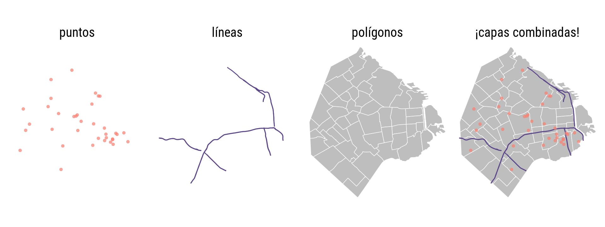

```{r setup, include=FALSE}
knitr::opts_chunk$set(echo=FALSE)
```

```{r message=FALSE, warning=FALSE, include=FALSE, paged.print=FALSE}
knitr::opts_chunk$set(echo=TRUE, message=FALSE, warning=FALSE, collapse=TRUE, highlight=TRUE, paged.print=FALSE, prompt=TRUE, strip.white=FALSE)
```

## Mirando al espacio

Los mapas son una unidad visual que puede reconocer prácticamente la totalidad de la población de una región determinada. La visualización de mapas  y el análisis espacial solía estar reservado para especialistas, debido a la complejidad y costo de este tipo de procesos. Pero durante las dos últimas décadas la tecnología digital cambió el panorama. Una dramática caída en el costo asociado a adquirir y procesar información geográfica (pensemos en satélites y computadoras multiplicándose y bajando de precio) dio paso al mapa digital como herramienta universal. 

Hoy en día, hacer mapas resulta algo muy fácil. Existen cada vez más repositorios con información georreferenciada de acceso publico -datasets que incluyen información precisa sobre su ubicación geográfica. Al mismo tiempo, maduran y se hacen más fáciles de usar las herramientas para análisis y visualización espacial. 

En R contamos con varios paquete de funciones que permiten manipular información espacial con facilidad. A continuación vamos a aprender a combinarlos con las herramientas que ya hemos aprendido, para hacer análisis geográfico y crear nuestros propios mapas.

### Geometrías

Los archivos de datos geográficos relacionados con fenómenos sociales (datos de cosas que somos y hacemos los humanos, como composición de población, trazado de rutas, ubicación de hospitales, etc) suelen ser de tipo vectorial. Los datos vectoriales expresan la posición y extensión de cosas mediante geometrías, que pueden ser de puntos, de líneas, o de polígonos. En la jerga de los sistemas de información geográfica, se les llama "capas" (_layers_) a los archivos que contienen estas geometrías, y en ese sentido se hablar de combinar capas para crear mapas.

{width=60%}

* Un archivo geográfico con geometría de __puntos__ se utiliza para marcar __posiciones__: por ejemplo, puntos que señalen la ubicación de hospitales.

* La geometría de __líneas__ permite mostrar __recorridos__: como por ejemplo la extensión de ríos, de autopistas o de calles. 

* Los __polígonos__ se usan cuando hay que representar __superficies__: el territorio de barrios, provincias o países; el terreno ocupado por parques y plazas, la extensión de parcelas, los límites de áreas especiales como un coto de caza, etc.

### Los datos georreferenciados

Los datos georeferenciados reciben su nombre justamente porque están vinculados a locaciones en el mundo físico. Estaciones de subte, hogares, reservas ecológicas, cualquier lugar que exista. Si bien hoy en día es más fácil que nunca trabajar con este tipo de datos, tienen algunas complicaciones. 

La principal de ellas está vinculada con la forma esférica irregular de la Tierra. No es un círculo perfecto, sino que está "achatada" en los polos, dificultando la matemática necesaria para comparar posiciones y medir distancias. Esta forma hace que sea imposible de representar a la exactitud en un plano de dos dimensiones. El proceso a través del cual desplegamos la tierra en dos para dibujarla en un mapa plano es la **proyección**.  

Las proyecciones cartográficas son instrucciones para traducir a un plano la disposición de puntos ubicados en la esfera terrestre. Toman como base los CRS: un sistema de números que definen ubicaciones sobre la superficie de la Tierra. El más conocido es el que usa latitud y longitud, para definir posiciones en los ejes norte-sur y este-oeste.

Inevitablemente, las proyecciones van a introducir distorsiones porque uan superficie curva no puede ser proyectada con exactitud en una superficie plana. Más específicamente, la proyección puede preservar ángulos o áreas pero no ambas. Existen muchísimas proyecciones distintas, cada una pensada para minimizar alguno de los tipos de distorsión, o para encontrar una solución de compromiso que los balancee.

La proyección más famosa y utilizada es la Mercator, que fue desarrollada en el siglo 16 para la navegación marítima. Esta proyección tiene como ventaja que no distorsiona las direcciones, por lo que permite fijar un rumbo de navegación consultando el mapa. Su principal problema es que produce una distorsión notable en las áreas cercanas a los polos: Groenlandia aparenta el mismo tamaño que toda África, cuando en realidad tiene sólo un quinceavo de su superficie. 

Sin embargo, Google la eligió para sus mapas en línea, y por razones de compatibilidad otros proveedores de mapas digitales la adoptaron también. Así, y para entendible irritación de especialistas en geografía, Mercator se convirtió en el estándar de facto para aplicaciones geográficas y mapas en la web.

{width=50%}

En la práctica, si trabajamos en forma frecuente con archivos georreferenciados vamos a sufrir tarde o temprano de problemas de coordenadas o proyección. El más común de ellos: tener una fuentes de datos geográficos que no podemos comparar con otras, porque desconocemos el sistema de coordenadas que se usó para crearla; es decir, no podemos saber a que posición sobre el planeta corresponde cada observación en los datos.

### Importando la data

Otro problema asociado a trabajar con datos geográficos es el de los formatos de archivo. El formato más común es el denominado “shapefile”, inventado por la empresa ESRI (los creadores del software ArcGIS). Es un formato incómodo porque guarda la información en varios archivos distintos, que suelen ser combinados en un archivo .zip para su distribución. Un inconveniente aún mayor es que los nombres de las variables en un shapefile deben tener 10 caracteres o menos, lo que facilita el uso de abreviaturas ininteligibles. A pesar de éstos y otros detrimentos, el formato es tan común que se ha vuelto sinónimo de archivo con información geográfica, y resiste a pesar de los esfuerzos por reemplazarlo con alternativas más modernas. Una de ellas es “GeoJSON”, un estándar abierto que corrige los dos inconvenientes mencionados antes. Para nuestros ejercicios usaremos datos geográficos en esta último formato.

Vamos a continuar trabajando con `ggplot2`, pero además vamos a incluir el paquete `sf` que sirve para trabajar específicamente con datos georeferenciados. 

```{r}
library(tidyverse)
library(ggplot2)
library(sf)
```
Practicaremos con datos georeferenciados en polígonos: los departamentos de la Provincia de Buenos Aires. 

```{r}
pba_geo <- read_sf("./data/deptos_pba.geojson")
```

Veamos cómo está compuesto este dataframe:

```{r}
head(pba_geo)
```


La data contiene información básica de cada provincia. Sin embargo, van a ver tiene una columna particular, cuyo formato no habíamos visto aún: `geometry`. Esta columna tiene la información de una serie de puntos que trazan un **polígono**. En otras palabras, contiene la forma de cada provincia Por esto esta variable será fundamental para realizar mapas en R, es el insumo básico de donde el programa saca la información para trazarlos. 

A partir de esto, graficar un mapa es tan simple como usar dos líneas de ggplot con la geometría `geom_sf`. 

```{r}
ggplot(pba_geo)+
        geom_sf()
```

### Información en mapas

Con frecuencia vemos información presentada en mapas. Un ejemplo de ellos es el [mapa del delito](https://mapa.seguridadciudad.gob.ar/) de CABA, otro es el [mapa de accesibilidad](https://acceso.shinyapps.io/mapa/) de factor~data.  Detengámonos un segundo a ver, ¿cuáles son las propiedades estéticas utilizadas para mostrar la información?

La forma más común de mostrar información geográfica es a través de **mapas coropléticos**, donde se colorean regiones individualmente de acuerdo a la dimensión de la información que se quiere mostrar. Para hacerlo, nada más hay que asignarle al atributo `fill`la dimensión que queremos plasmar. 

Vamos a agregarle capas de información a nuestro mapa. Por ejemplo, supongamos que queremos ver en el mapa qué departamentos tuvieron una mayor cantidad de homicidios dolosos en el año 2020. Para esto podemos usar la base de datos con la que estuvimos trabajando las últimas clases. Vamos a filtrarla e importar los casos que nos interesan.

```{r}
df <- readxl::read_xlsx("data/Integrado_HD_base_usuaria_2017-2020.xlsx")

#Formato
pba <- df %>% filter(provincia == "BUENOS AIRES") 

pba <- pba %>% filter(departamento != "Departamento sin determinar")

pba_2020 <- pba %>% filter(anio == 2020)
```

Luego, joineamos las dos bases. Una cosa **muy importante** es que siempre hay que poner la base con las geometrías a la izquierda, de lo contrario la columna `geometry` pierde el formato. 

```{r}
#Join
pba_geo_2020 <- pba_geo %>% left_join(pba_2020, by=c("in1"="Cod_INDEC"))
```

Ahora podemos hacer lo que ya sabemos: agrupar y contar los casos por `Id_hecho`.

```{r}
tb1 <- pba_geo_2020%>%
        group_by(anio, nam)%>%
        summarise(n=n_distinct(Id_hecho, na.rm = FALSE)) 
```
Como estamos trabajando el gráfico con `ggplot`, podemos pasarle el atributo estético `n` al parámetro `fill` para que los polígonos se pinten según la frecuencia de casos.

```{r}
ggplot(tb1, aes(fill=n))+
        geom_sf()
```


Acá vemos algo, pero las líneas grises que dibujan cada polígono nos dificultan ver los datos con claridad. Vamos a sacar estas líneas asignándole al parámetro `color = NA`:

```{r}
ggplot(tb1)+
        geom_sf(aes(fill = n), color = NA)
```

En este mapa, La Matanza destaca como el departamento con mayor cantidad de homicidios en 2020. Sin embargo, algo que no hemos mencionado aún es la importancia de "normalizar" las variables antes de mostrarlas en un mapa. En general, los lugares más grandes van a contener dentro "más" de cualquier variable que los lugares pequeños (sean personas, comercios o accidentes). En este sentido, es de esperar que La Matanza registre más incidentes que los demás departamentos ya que de acuerdo con las proyecciones poblacionales del último censo tiene 2.281.194 de habitantes. Lo que sería más útil aquí es presentar la relación entre homicidios y la cantidad de habitantes. 

Por eso vamos a incorporar un dataframe que nos de adicional: las proyecciones poblacionales por departamento. 

```{r}
proyecciones <- readxl::read_excel("data/proy_1025_depto_buenos_aires.xls") %>% drop_na()

proyecciones_2020 <- proyecciones %>% select(departamento, Proyecciones_2020)

pba_geo_2020 <- pba_geo_2020 %>% 
        left_join(proyecciones_2020, by = c("nam" = "departamento"))
```

Ahora sí, vamos a agrupar por año, departamento y tamaño de la población.

```{r}
tb2 <- pba_geo_2020%>%
        group_by(anio, nam, Proyecciones_2020)%>%
        summarise(n=n_distinct(Id_hecho, na.rm = TRUE)) 
```
Y lo vamos a graficar. 

```{r}
ggplot(tb2)+
        geom_sf(aes(fill = n/Proyecciones_2020), color = NA)
```

Este último gráfico representa de forma mucho mas precisa la distribución homicidios dolosos por habitante en la provincia. Pero tenemos una mejora más por realizar: elegir una escala de color que haga más legible el gráfico, ayudando al ojo a diferenciar las áreas donde la densidad es particularmente alta o baja. Apelamos a ["viridis"](https://cran.r-project.org/web/packages/viridis/vignettes/intro-to-viridis.html), una escala diseñada para ser fácil de interpretar... y lucir bien de paso. Para usar virids, agregamos `scale_fill_viridis_d()` cuando se muestra una variable categórica, y `scale_fill_viridis_c() `cuando se trata de una variable continua, nuestro caso en este momento.

```{r}
library(viridis)

ggplot(tb2)+
        geom_sf(aes(fill = n/Proyecciones_2020), color = NA)+
        scale_fill_viridis_c()+
        labs(title = "Provincia de Buenos Aires",
             subtitle = "Homicidios dolosos en 2020",
             fill = "HD/Cant. habitantes")+
        theme_minimal()
```


Vemos que parecen otros departamentos en tonos verde agua y amarilllo que nos llaman la atención. A priori podemos ver que los departamentos de Pellegrini, San Pedro, Baradero o Capitán Sarmiento parecen tener una cantidad relativamente más alta de homicidios que los demás departamentos.

### Tiempo y espacio

```{r}
pufeaf <- readxl::read_xlsx('./data/muertesviales_2017-2020.xlsx')

pufeaf <-pufeaf %>% filter(provincia == "BUENOS AIRES")

pufeaf <- pba_geo %>% 
        left_join(pufeaf, by = c("nam" = "departamento"))

x <- pufeaf %>% group_by(anio, nam) %>%
        summarise(n=n_distinct(Id_hecho, na.rm=TRUE))

ggplot(x, aes(fill=n), color=NA)+
        geom_sf()+
        facet_wrap(vars(anio))
```

